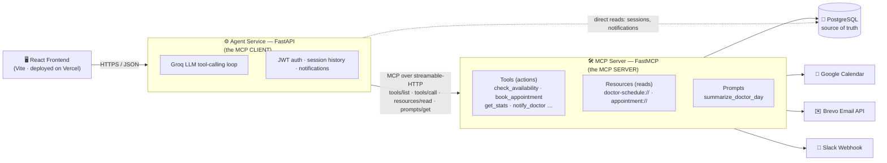

<div align="center">


# MediFlow-AI

**An agentic AI clinic assistant — patients book appointments by chatting in plain English, doctors get instant summaries and reports, and every action is powered by a genuine MCP tool-calling loop.**

[](https://medi-flow-ai-six.vercel.app/)
[](DOCUMENTATION.md)

<br/>


</div>

---

## 📚 Table of Contents

- [Overview](#-overview)
- [Architecture](#-architecture)
- [Why This Satisfies the MCP Requirement](#-why-this-satisfies-the-mcp-requirement)
- [Repo Layout](#-repo-layout)
- [MCP Primitives Exposed by the Server](#-mcp-primitives-exposed-by-the-server)
- [Setup](#-setup)
- [Sample Prompts](#-sample-prompts)
- [API Usage Summary](#-api-usage-summary)
- [Architecture Decisions](#-architecture-decisions)
- [Screenshots](#-screenshots)

---

## 🩺 Overview

MediFlow-AI is a full-stack clinic assistant with two roles:

| 🧑‍🦱 Patient | 👨‍⚕️ Doctor |
|---|---|
| Chats in plain English to check a doctor's availability and book an appointment — no forms, no dropdowns | Gets a one-click daily summary, free-form natural-language reporting, and a live in-app notification feed |
| Gets a real confirmation email + Google Calendar invite on booking | Sees every new booking land as a dashboard notification automatically |

Nothing is hardcoded. Every decision — which tool to call, when to ask a follow-up question, how to phrase the answer — is made at runtime by a Groq-hosted Llama model that discovers the available tools over the **Model Context Protocol (MCP)**.

> 📖 For the full architecture diagram, tech-stack rationale, data model, MCP primitive breakdown, auth model, request-flow walkthrough, and design-decision writeups → **[read DOCUMENTATION.md](DOCUMENTATION.md)**.

---

## 🏗️ Architecture

MediFlow-AI is a genuine **MCP client/server pair** plus a React frontend — three independently-runnable processes:



**Why a client/server split instead of one backend?** The LLM never gets hardcoded, privileged access to business logic — it only gets what the MCP server chooses to expose as a tool schema.

---

## ✅ Why This Satisfies the MCP Requirement

- 🚫 **No direct backend function calls.** `agent_service/` never imports anything from `mcp_server/`. The only way it reaches a tool is `ClientSession.call_tool(name, args)` over a real streamable-HTTP connection to a separately-run process ([mcp_client.py](agent_service/mcp_client.py)).
- 🔍 **Dynamic discovery.** Every turn, [groq_orchestrator.py](agent_service/groq_orchestrator.py) calls `session.list_tools()` and builds the Groq tool schema from the response — there is no hardcoded tool-definition dict anywhere in the agent code.
- 🧠 **LLM-driven orchestration.** There is no `if "book" in text` routing. The loop just forwards whatever `tool_calls` Groq returns to `call_tool` and feeds results back — see the `while` loop in `run_agent_turn`.
- 🧩 **Clear separation.** `mcp_server/` (tools, resources, prompts, DB/Calendar/Email access) and `agent_service/` (LLM orchestration, MCP client, session store) are two independently-runnable processes, not one `main.py`.

---

## 📂 Repo Layout

```
mcp_server/       FastMCP app — tools, resources, prompts (the MCP "server")
  server.py         tool/resource/prompt registrations
  db.py             Postgres access layer
  google_calendar.py  Google Calendar event creation (OAuth refresh-token flow)
  email_service.py    Brevo API confirmation emails
agent_service/    FastAPI app — the MCP "client" + Groq orchestration
  main.py            HTTP API for the frontend
  mcp_client.py       wraps ClientSession / tool discovery / result formatting
  groq_orchestrator.py  the tool-calling loop
  session_store.py    conversation history, keyed by session_id (Postgres)
  notifications_store.py  direct reads for the dashboard notifications panel
frontend/         React (Vite) chat UI + doctor dashboard
db/               schema.sql, seed.sql
docker-compose.yml  Postgres container for local dev
DOCUMENTATION.md  full design & architecture writeup
```

---

## 🔧 MCP Primitives Exposed by the Server

<table>
<tr><td width="33%" valign="top">

**🛠️ Tools** *(actions)*

- `check_doctor_availability`
- `book_appointment`
- `reschedule_appointment`
- `suggest_reschedule`
- `get_appointment_stats`
- `notify_doctor`
- `send_appointment_confirmation_email`

</td><td width="33%" valign="top">

**📖 Resources** *(read-only, addressable)*

- `doctor-schedule://{doctor_name}/{date}`
- `appointment://{appointment_id}`

The dashboard's schedule view reads these directly (`GET /doctor/schedule`) with **no LLM involved** — resources are for context reads, tools are for actions.

</td><td width="33%" valign="top">

**📝 Prompt** *(template)*

- `summarize_doctor_day(doctor_name, date)`

The dashboard's **"Get Today's Summary"** button calls `POST /agent/summary`, which fetches this prompt via a real `prompts/get` call and runs the returned text through the same tool-calling loop as any other message.

</td></tr>
</table>

---

## 🚀 Setup

Follow these steps in order — each one depends on the previous.

### 1. Prerequisites

- Python 3.11+
- Node.js 18+
- Docker (for the local Postgres container) — or any reachable Postgres instance
- A free [Groq API key](https://console.groq.com/keys)

### 2. Clone and enter the repo

```bash
git clone <this-repo-url>
cd MediFlow-AI
```

### 3. Start Postgres

This repo ships a `docker-compose.yml` (Postgres on host port **5433**, to avoid clashing with any other local Postgres on 5432):

```bash
docker compose up -d
docker exec -i mediflow-postgres psql -U mediflow -d mediflow < db/schema.sql
docker exec -i mediflow-postgres psql -U mediflow -d mediflow < db/seed.sql
```

> No Docker? Point `DATABASE_URL` in `.env` at any Postgres instance and run the same two `psql` files against it directly.

Seed data includes 3 demo doctors (Dr. Ahuja, Dr. Mehta, Dr. Rao — see [db/seed.sql](db/seed.sql)) and 5 demo patients, with a spread of appointments computed relative to today's date so "today" / "this week" prompts always have real data behind them. All three seeded doctors share the demo login password `mediflow123`.

### 4. Configure environment variables

```bash
cp .env.example .env
```

Open `.env` and fill in at minimum `GROQ_API_KEY`. Everything else has a sane local default or is optional:

| Variable | Required? | Notes |
|---|---|---|
| `DATABASE_URL` | Yes | Defaults to the docker-compose Postgres on port 5433 |
| `GROQ_API_KEY` | **Yes** | Free tier at [console.groq.com/keys](https://console.groq.com/keys) |
| `GROQ_MODEL` | No | Defaults to `llama-3.1-8b-instant` |
| `MCP_SERVER_URL` | Yes | Defaults to `http://localhost:8100/mcp` |
| `MCP_SHARED_SECRET` | No | Set the same value on both services to require a bearer token between them |
| `CORS_ORIGINS` | Yes | Comma-separated frontend origins allowed to call the agent service |
| `GOOGLE_CLIENT_ID` / `GOOGLE_CLIENT_SECRET` / `GOOGLE_REFRESH_TOKEN` / `GOOGLE_CALENDAR_ID` | No | Calendar events are skipped gracefully if blank — see [scripts/get_google_refresh_token.py](scripts/get_google_refresh_token.py) to mint a refresh token |
| `BREVO_API_KEY` / `BREVO_SENDER_EMAIL` / `BREVO_SENDER_NAME` | No | Confirmation emails are skipped gracefully if blank; `BREVO_SENDER_EMAIL` must be a verified sender in your Brevo account |
| `SLACK_WEBHOOK_URL` | No | Enables the `notify_doctor` Slack channel |
| `JWT_SECRET` | Yes | Change from the default before any real deployment |
| `SUPABASE_URL` / `SUPABASE_ANON_KEY` | No | Only needed for "Sign in with Google" |

Google Calendar and Brevo email are optional — `book_appointment` and `send_appointment_confirmation_email` degrade gracefully (booking still succeeds in Postgres; the tool just reports that the calendar/email step was skipped) when those env vars are blank, so you can demo the whole flow without setting them up.

### 5. Python environment (shared by both backend services)

```bash
python -m venv .venv

# Windows:
.venv\Scripts\pip install -r mcp_server/requirements.txt -r agent_service/requirements.txt

# macOS/Linux:
.venv/bin/pip install -r mcp_server/requirements.txt -r agent_service/requirements.txt
```

### 6. Frontend dependencies

```bash
cd frontend
npm install
cp .env.example .env   # or create .env with VITE_AGENT_SERVICE_URL=http://localhost:8200
cd ..
```

### 7. Run all three processes

Each service runs standalone in its own terminal:

```bash
# Terminal 1 — MCP server (port 8100)
.venv\Scripts\python mcp_server\server.py

# Terminal 2 — Agent service (port 8200)
.venv\Scripts\python agent_service\main.py

# Terminal 3 — Frontend (port 5173)
cd frontend && npm run dev
```

> macOS/Linux: use `.venv/bin/python` instead of `.venv\Scripts\python`.

Open **http://localhost:5173**, sign up as a patient, or log in as a seeded doctor (e.g. `ahuja@mediflow.example` / `mediflow123`).

### 8. (Optional) Verify the MCP server independently

Use the official [MCP Inspector](https://github.com/modelcontextprotocol/inspector) CLI before touching the agent, to confirm tools are registered correctly:

```bash
npx @modelcontextprotocol/inspector --cli http://localhost:8100/mcp --method tools/list
npx @modelcontextprotocol/inspector --cli http://localhost:8100/mcp --method tools/call \
  --tool-name check_doctor_availability --tool-arg doctor_name="Ahuja" --tool-arg date="today"
```

### 9. (Optional) Run the test suite

```bash
.venv\Scripts\pytest agent_service/tests mcp_server/tests
```

---

## 💬 Sample Prompts

### 🧑‍🦱 Patient Chat

Try these in order — the flow demonstrates real multi-turn memory (you don't have to repeat the doctor's name or your own details once given):

| # | Prompt |
|---|---|
| 1️⃣ Check availability | `Check Dr. Ahuja's availability for tomorrow morning.` |
| 2️⃣ Book a specific slot (name, email, reason in one message) | `Book me with Dr. Ahuja tomorrow at 10am, I'm Jane Doe, jane@example.com, reason: checkup.` |
| 3️⃣ Reporting-style question | `How many patients came in with fever this week?` |

### 👨‍⚕️ Doctor Dashboard

Log in as a seeded doctor (`ahuja@mediflow.example` / `mediflow123`) and try:

| # | Prompt |
|---|---|
| 1️⃣ One-click summary | Click **"Get Today's Summary"** — exercises the `summarize_doctor_day` MCP prompt template and delivers the result to the in-app notification bell |
| 2️⃣ Natural-language reporting | `How many appointments do I have today and tomorrow?` |
| 3️⃣ Filtered reporting | `How many patients came in with fever?` |

---

## 🔌 API Usage Summary

All routes are served by the **agent service** (default `http://localhost:8200`); the frontend never calls the MCP server directly. Routes marked 🔒 require `Authorization: Bearer <jwt>` (obtained from `/auth/login`, `/auth/signup`, or `/auth/google`); 🔒👨‍⚕️ additionally requires the `doctor` role.

| Method | Path | Purpose |
|---|---|---|
| `POST` | `/auth/signup` | Create an account (`role: "patient"` or `"doctor"`; doctor signup restricted to pre-seeded emails) |
| `POST` | `/auth/login` | Email/password login, returns a JWT |
| `POST` | `/auth/google` | Login/signup via a Supabase-verified Google identity |
| `POST` | `/agent/message` 🔒 | Send a chat message; runs the Groq tool-calling loop and returns the assistant's reply |
| `POST` | `/agent/summary` 🔒👨‍⚕️ | Runs the `summarize_doctor_day` MCP prompt for the caller's own schedule and pushes the result as an in-app notification |
| `GET` | `/doctor/schedule` 🔒👨‍⚕️ | Reads the `doctor-schedule://` MCP resource directly (no LLM) for the caller's own schedule |
| `GET` | `/appointment/{appointment_id}` 🔒 | Reads the `appointment://` MCP resource directly; caller must be the patient or doctor on that appointment |
| `GET` | `/notifications/{doctor_id}` 🔒👨‍⚕️ | List a doctor's notifications (`?unread_only=true` supported) |
| `POST` | `/notifications/{notification_id}/read` 🔒👨‍⚕️ | Mark a notification read |
| `GET` | `/sessions` 🔒 | List the caller's past chat sessions |
| `GET` | `/session/{session_id}/history` 🔒 | Rehydrate a session's visible transcript |
| `PATCH` | `/session/{session_id}` 🔒 | Rename a session |
| `DELETE` | `/session/{session_id}` 🔒 | Delete a session |
| `DELETE` | `/sessions` 🔒 | Delete all of the caller's sessions |
| `GET` | `/prompt-history` 🔒 | Flat, timestamped log of every prompt the caller has typed |
| `GET` | `/health` | Liveness check, no auth |

<details>
<summary><strong>Example — sending a chat message (click to expand)</strong></summary>

```bash
curl -X POST http://localhost:8200/agent/message \
  -H "Authorization: Bearer <jwt>" \
  -H "Content-Type: application/json" \
  -d '{
        "session_id": "sess_123",
        "text": "Check Dr. Ahuja availability tomorrow morning"
      }'
```

```json
{
  "session_id": "sess_123",
  "reply": "Dr. Ahuja has these free slots tomorrow morning: 09:00, 09:30, 10:00, 11:30."
}
```

</details>

For the underlying MCP tool/resource/prompt contracts (what the agent service itself calls on the MCP server), see [§6 of DOCUMENTATION.md](DOCUMENTATION.md#6-mcp-primitives-tools-resources-prompts).

---

## 🧭 Architecture Decisions

- **Streamable-HTTP over stdio.** The MCP server runs as its own long-lived process serving `http://localhost:8100/mcp`, so it can be restarted, load-balanced, or hosted independently of the agent — matches "genuinely separate service" better than spawning it as a stdio subprocess of the agent.
- **Groq + Llama 3.1 8B.** OpenAI-compatible `tools=[...]` function-calling API, so converting an MCP `inputSchema` into a Groq tool schema is a direct passthrough (`mcp_client.tool_to_groq_schema`). The smaller 8B model is used deliberately — this app's tool-calling loop can make several completions per user turn, and it clears Groq's free-tier rate limits far less often than the 70B model.
- **One shared Postgres, two independent access layers.** `mcp_server/db.py` and `agent_service/session_store.py` / `notifications_store.py` intentionally don't share code — the agent service's direct Postgres reads (session history, notifications) are ordinary application plumbing for the UI, not tool execution on the LLM's behalf, so they're exempt from the "must go through MCP" rule (which only applies to actions the LLM decides to take).
- **Graceful degradation for Calendar/Email.** Postgres is the appointment system of record; Google Calendar and email are best-effort layers on top. Missing credentials produce a clear tool result the LLM can relay in plain language, rather than an unhandled exception.

> See **[DOCUMENTATION.md](DOCUMENTATION.md)** for the full design writeup, including the end-to-end booking request flow, deployment topology, and reliability/failure-handling table.

---

## 📸 Screenshots

### 1️⃣ Patient Chat — Conversational Booking with Conflict Handling


The patient asks to book Dr. Ahuja at 4 PM; since that slot is taken, the agent checks real availability and offers 3:30 PM / 4:30 PM instead of guessing. Once the patient confirms, the booking, Google Calendar event, and confirmation email are all created in one turn.

### 2️⃣ Doctor Dashboard — One-Click Summary & Natural-Language Reporting


Dr. Ahuja's "Get Today's Summary" button runs the `summarize_doctor_day` MCP prompt and returns a plain-language breakdown of the day's patients. The same chat box then answers a free-form follow-up ("today and tomorrow") using `get_appointment_stats`.

### 3️⃣ Doctor Dashboard — In-App Notification Delivery


The generated summary is also pushed to the notification bell as an `IN_APP` entry, proving the report reaches the doctor through a delivery channel separate from the patient-side confirmation email.

---

<div align="center">

**[⬆ Back to top](#mediflow-ai)** · Built with FastAPI, FastMCP, Groq, and React · [MIT Licensed](LICENSE)

</div>
